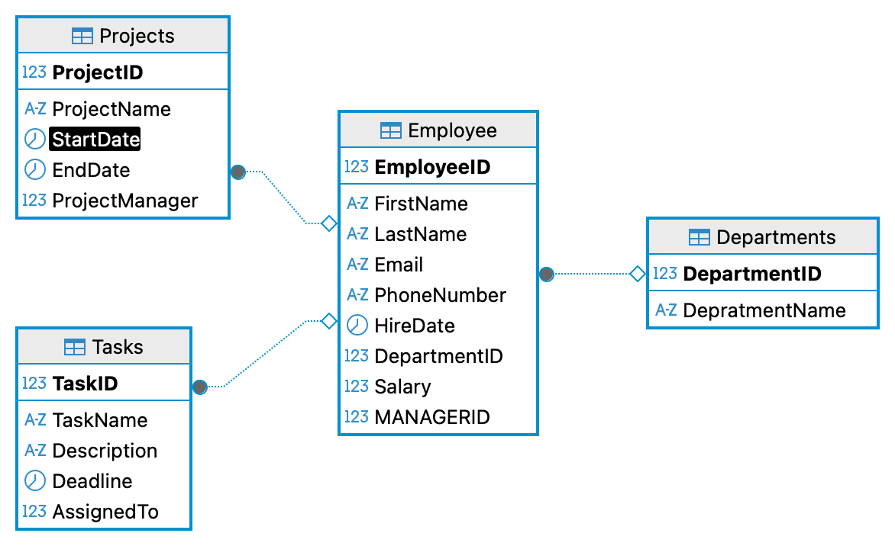

# 🗄️ SQL Revision — Employee DB
📎 **Table Schema Reference →** 

## Quick-Reference Cheat Sheet

| Keyword / Function | Does What |
|---|---|
| `COALESCE(a, b)` | First non-NULL value |
| `CONCAT(a, b)` | Join strings |
| `LENGTH(s)` | Character count |
| `SUBSTRING(s, start, len)` | Extract part of string |
| `CASE … WHEN … END` | Conditional labelling |
| Subquery in `FROM` | Derived / temporary table |
| Subquery in `WHERE` | Scalar comparison value |

---

## 0. NULL Handling & COALESCE

> **What's happening:** Some employees have no first name or no last name. `COALESCE` picks the first non-NULL value from a list — handy for a "display name" fallback.

<details>
<summary>👉 COALESCE — pick the first non-NULL value</summary>

```sql
SELECT COALESCE(FirstName, LastName)     -- returns FirstName if not NULL, else LastName
FROM Employee;
```

**Keyword:** `COALESCE` scans its arguments left → right and returns the **first one that isn't NULL**.
</details>

---

## 1. Subquery in FROM (Derived Table)

> **What's happening:** You wrap a `SELECT` inside another `SELECT`'s `FROM` clause. The inner query runs first and its result becomes a temporary table you can query again.

<details>
<summary>👉 Count employees per department, then filter departments</summary>

```sql
SELECT *
FROM (
    SELECT DepartmentID, COUNT(*) AS EmployeeCount   -- inner query runs first
    FROM Employee
    GROUP BY DepartmentID
) AS t                                               -- alias is required
WHERE t.DepartmentID IN (1, 3);                      -- filter the result
```

**Keywords:** The inner `SELECT … GROUP BY` is the **subquery** · `AS t` names it so the outer query can reference it · `IN (1, 3)` checks membership in a list.

</details>

---

## 2. String Functions — CONCAT & LENGTH

<details>
<summary>👉 Build a full name and filter by its length</summary>

```sql
SELECT CONCAT(FirstName, ' ', LastName) AS Name      -- glues strings together
FROM Employee
WHERE LENGTH(CONCAT(FirstName, ' ', LastName)) > 10; -- filter by total length
```

**Keywords:** `CONCAT()` joins strings into one · `LENGTH()` returns the character count of a string.

> 💡 Notice `CONCAT(…)` is written twice — in a real project you might use a CTE or a computed column to avoid that duplication.

</details>

---

## 3. SUBSTRING — Extracting Part of a String

<details>
<summary>👉 Grab the first few characters of a name</summary>

```sql
-- ✅ Correct usage
SELECT CONCAT(SUBSTRING(FirstName, 1, 3), '.', LastName)   -- first 3 chars + . + last name
FROM Employee;
```

**Keywords:** `SUBSTRING(str, start, length)` — `start` is 1-based · `length` is how many characters to pull.

| Argument | Meaning                          |
|----------|----------------------------------|
| `1`      | Start at the 1st character       |
| `3`      | Take 3 characters                |

</details>

---

## 4. Subquery in WHERE (Scalar Subquery)

> **What's happening:** The inner `SELECT` returns a **single value** (the average salary). The outer query compares every row against that one number.

<details>
<summary>👉 Find employees earning above average</summary>

```sql
SELECT EmployeeID
FROM Employee
WHERE Salary > (SELECT AVG(Salary) FROM Employee);   -- scalar subquery
--              ↑ this whole thing evaluates to one number
```

**Keyword:** The parenthesised `SELECT` is a **scalar subquery** — it must return exactly one value. That value is then used in the `WHERE` comparison.

</details>

---

## 5. CASE Expression — Conditional Logic

> **What's happening:** `CASE` lets you label or bucket rows based on conditions — think of it as an `if / else if / else` inside SQL.

<details>
<summary>👉 Categorise employees into earner tiers</summary>

```sql
SELECT
    COUNT(*) AS earner_count,
    CASE                                             -- evaluated per row
        WHEN Salary > 70000 THEN 'high'
        WHEN Salary > 50000 THEN 'medium'
        WHEN Salary > 0     THEN 'low'
        ELSE 'invalid_salary'
    END AS earner_type                               -- END closes the CASE
FROM Employee
GROUP BY earner_type;
```

**Keywords:** `CASE … WHEN … THEN … ELSE … END` — conditions are checked **top to bottom**; the first match wins. `END` is mandatory to close the block.

> 💡 Order matters: if you put `> 50000` before `> 70000`, every high earner would be labelled "medium".

</details>

---

## 6. Putting It All Together — CASE + Subquery + Aggregates

> **What's happening:** A `CASE` expression lives inside a subquery that labels every employee. The outer query then groups by those labels and computes salary stats per tier.

<details>
<summary>👉 Min / Max / Avg salary per earner tier</summary>

```sql
SELECT
    earner_type,
    MIN(Salary),                                     -- cheapest in the group
    MAX(Salary),                                     -- most expensive
    AVG(Salary)                                      -- mean of the group
FROM (
    SELECT EmployeeID, Salary,
        CASE
            WHEN Salary > 70000 THEN 'high'
            WHEN Salary > 50000 THEN 'medium'
            WHEN Salary > 0     THEN 'low'
            ELSE 'invalid_salary'
        END AS earner_type                           -- label created here
    FROM Employee
) AS t                                               -- subquery result
GROUP BY earner_type;                                -- one output row per tier
```

**Keywords:** `MIN / MAX / AVG` are **aggregate functions** that collapse each group into summary stats · the inner subquery does the labelling · `GROUP BY` on the outer query does the bucketing.

</details>

---

