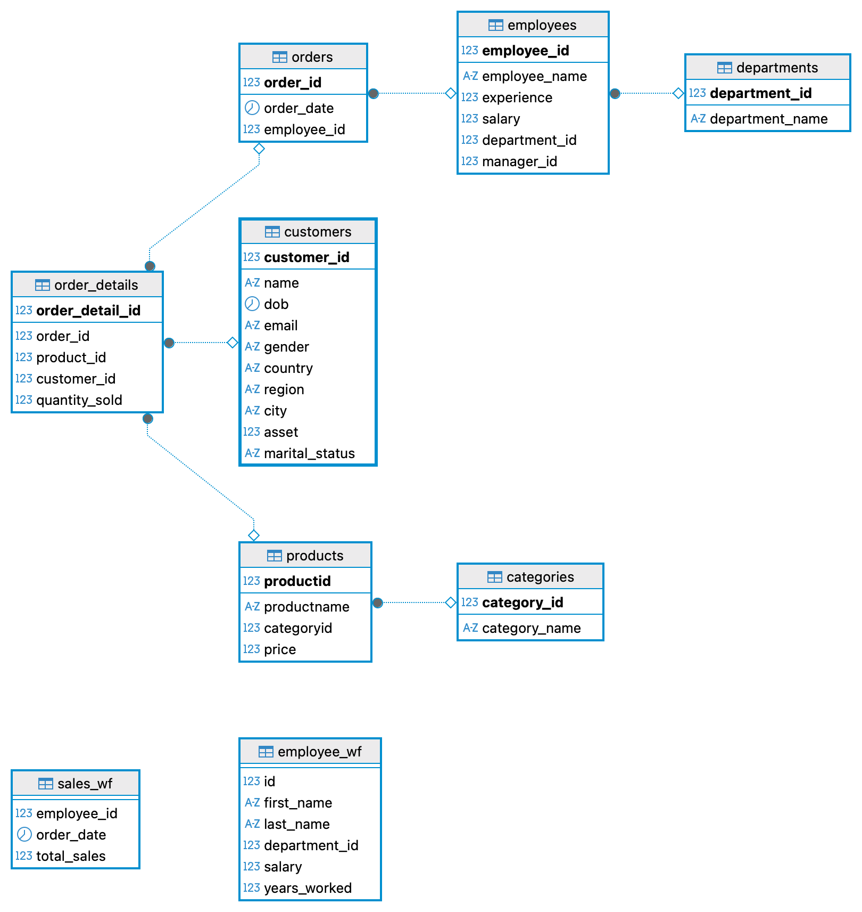

# 🗄️ SQL Revision — Day 2

📎 **Table Schema Reference →** 

---

## ALTER TABLE & CONSTRAINTS

---

### How do you make a column mandatory (non-nullable)?

<details>
<summary>Answer</summary>

```sql
ALTER TABLE employees
MODIFY employee_name VARCHAR(255) NOT NULL;
```

</details>

---

### How do you set a default value and add a check constraint on a column?

<details>
<summary>Answer</summary>

```sql
ALTER TABLE employees ALTER salary SET DEFAULT 30000;

ALTER TABLE employees
ADD CONSTRAINT chk_salary_positive CHECK (salary > 0);
```

</details>

---

### What happens when you violate a NOT NULL, CHECK, or DEFAULT constraint?

<details>
<summary>❌ Violates NOT NULL — employee_name is NULL</summary>

```sql
INSERT INTO employees (employee_id, employee_name, experience, salary, department_id, manager_id)
VALUES (1001, NULL, 5, 25000.00, 1, NULL);
-- Error: employee_name was set to NOT NULL
```

</details>

<details>
<summary>❌ Violates CHECK — salary is NULL (fails salary > 0)</summary>

```sql
INSERT INTO employees (employee_id, employee_name, experience, salary, department_id, manager_id)
VALUES (1002, 'SALARY-CHEC-2', 5, NULL, 1, NULL);
-- Error: CHECK constraint chk_salary_positive fails
```

</details>

<details>
<summary>✅ DEFAULT kicks in — salary column omitted entirely</summary>

```sql
INSERT INTO employees (employee_id, employee_name, experience, department_id, manager_id)
VALUES (1003, 'SALARY-CHEC-3', 5, 1, NULL);
-- Works: salary gets the DEFAULT value of 30000
```

</details>

---

### How do you enforce uniqueness on a column?

<details>
<summary>Answer</summary>

```sql
ALTER TABLE customers
MODIFY email VARCHAR(255) UNIQUE NOT NULL;
```

</details>

---
---

## JOINS

---

### How do you get customers who have placed at least one order?

<details>
<summary>Answer</summary>

```sql
SELECT c.name, o.order_date
FROM orders o
INNER JOIN order_details od
    ON o.order_id = od.order_id
INNER JOIN customers c
    ON od.customer_id = c.customer_id;
```

</details>

---

### Which employee made the most sales? Show top 5.

<details>
<summary>Answer</summary>

```sql
SELECT e.employee_name AS empl_name, COUNT(*) AS count_sales
FROM orders o
INNER JOIN order_details od
    ON o.order_id = od.order_id
INNER JOIN customers c
    ON od.customer_id = c.customer_id
INNER JOIN employees e
    ON e.employee_id = o.employee_id
GROUP BY empl_name
ORDER BY count_sales DESC
LIMIT 5;
```

</details>

---

### Which product has been sold the most?

<details>
<summary>Answer</summary>

```sql
SELECT p.productname, COUNT(*) AS no_of_items_sold
FROM products p
INNER JOIN order_details od
    ON p.productid = od.product_id
GROUP BY p.productid
ORDER BY no_of_items_sold DESC
LIMIT 1;
```

</details>

---

### What is the male/female customer split (%)?

<details>
<summary>Answer</summary>

```sql
SELECT
    COUNT(CASE WHEN gender = 'Male'   THEN 1 END) * 100 / COUNT(*) AS male,
    COUNT(CASE WHEN gender = 'Female' THEN 1 END) * 100 / COUNT(*) AS female
FROM customers;
```

</details>

---

### How do you find how many employees each manager has?

<details>
<summary>Answer — Self Join</summary>

```sql
SELECT e.employee_name AS manager, COUNT(m.employee_name) AS no_of_employees
FROM employees e
JOIN employees m
    ON e.employee_id = m.manager_id
GROUP BY e.employee_name;
```

> Both `e` and `m` point to the same table. `e` is the manager, `m` is the subordinate.

</details>

---
---

## SUBQUERIES

---

### Find the employee with the highest salary.

<details>
<summary>Answer</summary>

```sql
SELECT *
FROM employees
WHERE salary = (SELECT MAX(salary) FROM employees);
```

</details>

---

### Find employees who belong to department 1 or 2.

<details>
<summary>Answer</summary>

```sql
SELECT *
FROM employees
WHERE department_id IN (
    SELECT department_id
    FROM departments
    WHERE department_id = 1 OR department_id = 2
);
```

</details>

---

### Find employees in the same department AND same salary as employee 101.

<details>
<summary>Answer — Tuple matching</summary>

```sql
SELECT *
FROM employees
WHERE (department_id, salary) =
    (SELECT department_id, salary
     FROM employees
     WHERE employee_id = 101);
```

> The left side `(department_id, salary)` is matched as a pair against the subquery's two columns. Both must match.

</details>

---

### Display every employee's details alongside the overall average salary.

<details>
<summary>Answer A — Cross join with subquery (total avg)</summary>

```sql
SELECT a.*, b.avg_sal
FROM employees a,
     (SELECT AVG(salary) AS avg_sal FROM employees) AS b;
```

> No `ON` clause — every row in `employees` pairs with the single-row subquery result.

</details>

<details>
<summary>Answer B — Department-wise avg (JOIN ON)</summary>

```sql
SELECT a.*, b.avg_sal
FROM employees a
JOIN (
    SELECT department_id, AVG(salary) AS avg_sal
    FROM employees
    GROUP BY department_id
) AS b
ON a.department_id = b.department_id;
```

</details>

---
---

## WINDOW FUNCTIONS

---

### What is the difference between a subquery approach and a window function for average salary?

<details>
<summary>Answer A — Subquery (old way)</summary>

```sql
SELECT a.*, b.avg_sal
FROM employee_wf a,
     (SELECT AVG(salary) AS avg_sal FROM employee_wf) AS b;
```

</details>

<details>
<summary>Answer B — Window function (cleaner)</summary>

```sql
SELECT *, AVG(salary) OVER() AS avg_sal
FROM employee_wf;
```

> `OVER()` with nothing inside = applies across the entire result set. No subquery needed.

</details>

---

### How do you get department-wise average salary with all employee details?

<details>
<summary>Answer A — Subquery + JOIN</summary>

```sql
SELECT a.*, b.dept_avg
FROM employee_wf a
JOIN (
    SELECT department_id, AVG(salary) AS dept_avg
    FROM employee_wf
    GROUP BY department_id
) AS b
ON a.department_id = b.department_id
ORDER BY department_id;
```

</details>

<details>
<summary>Answer B — Window function</summary>

```sql
SELECT *,
    AVG(salary) OVER(PARTITION BY department_id) AS dept_avg
FROM employee_wf
ORDER BY department_id;
```

> `PARTITION BY` splits the window into one group per department.

</details>

---

### How do you calculate each employee's salary as a percentage of their department total?

<details>
<summary>Answer A — Subquery + JOIN</summary>

```sql
SELECT a.id, ROUND(a.salary * 100.0 / b.total_dept_sum, 2) AS per_taken
FROM employee_wf a
JOIN (
    SELECT department_id, SUM(salary) AS total_dept_sum
    FROM employee_wf
    GROUP BY department_id
) AS b
ON a.department_id = b.department_id
ORDER BY a.id;
```

</details>

<details>
<summary>Answer B — Window function</summary>

```sql
SELECT id,
    ROUND(salary * 100.0 / SUM(salary) OVER(PARTITION BY department_id), 2) AS per_taken
FROM employee_wf
ORDER BY id;
```

</details>

---

### How do you calculate a cumulative (running) average within each department?

<details>
<summary>Answer</summary>

```sql
SELECT
    id,
    CONCAT(first_name, ' ', last_name) AS name,
    years_worked AS experience,
    salary,
    AVG(salary) OVER(
        PARTITION BY department_id
        ORDER BY years_worked
        ROWS BETWEEN UNBOUNDED PRECEDING AND CURRENT ROW
    ) AS cumulative_avg
FROM employee_wf;
```

> `UNBOUNDED PRECEDING → CURRENT ROW` means: from the very first row of this partition up to the current row. Swap `AVG` → `SUM` for a running total.

</details>

---

### How do you calculate a cumulative sum across the entire table (not per department)?

<details>
<summary>Answer</summary>

```sql
SELECT
    employee_id,
    employee_name AS name,
    experience,
    salary,
    SUM(salary) OVER(
        ORDER BY experience, employee_id
        ROWS BETWEEN UNBOUNDED PRECEDING AND CURRENT ROW
    ) AS cumulative_sum
FROM employees
ORDER BY experience;
```

> No `PARTITION BY` = the whole table is one single window. Added `employee_id` to `ORDER BY` for stable sorting when experience ties.

</details>

---

### How do you calculate each employee's running total of sales, day by day?

<details>
<summary>Answer</summary>

```sql
SELECT
    employee_id,
    order_date,
    total_sales,
    SUM(total_sales) OVER(
        PARTITION BY employee_id
        ORDER BY order_date
        ROWS BETWEEN UNBOUNDED PRECEDING AND CURRENT ROW
    ) AS running_total_sales
FROM sales_wf
ORDER BY employee_id, order_date;
```

</details>

---

### How do you calculate a moving average over nearby orders?

<details>
<summary>Answer A — Centered window (previous + current + next)</summary>

```sql
SELECT
    employee_id,
    order_date,
    total_sales,
    ROUND(AVG(total_sales) OVER(
        PARTITION BY employee_id
        ORDER BY order_date
        ROWS BETWEEN 1 PRECEDING AND 1 FOLLOWING
    ), 2) AS moving_3_avg
FROM sales_wf
ORDER BY employee_id, order_date;
```

> Window = [row before, current row, row after]. If a row has no neighbor on one side, that side is simply skipped.

</details>

<details>
<summary>Answer B — Forward-looking window (current + next 2)</summary>

```sql
SELECT
    employee_id,
    order_date,
    total_sales,
    SUM(total_sales) OVER(
        PARTITION BY employee_id
        ORDER BY order_date
        ROWS BETWEEN CURRENT ROW AND 2 FOLLOWING
    ) AS forward_3_sum
FROM sales_wf
ORDER BY employee_id, order_date;
```

> Window = [current row, next row, row after that]. Useful for forecasting-style totals.

</details>

---
---

## RANKING FUNCTIONS

---

### How do you assign a unique row number to each row within a partition?

<details>
<summary>Answer — ROW_NUMBER()</summary>

```sql
SELECT
    employee_id,
    order_date,
    total_sales,
    ROW_NUMBER() OVER(PARTITION BY employee_id) AS row_no
FROM sales_wf;
```

> Every row gets a unique number within its partition. Ties don't matter — it just increments.

</details>

---

### How do you rank employees by salary within each department?

<details>
<summary>Answer — RANK()</summary>

```sql
SELECT
    id,
    first_name,
    department_id,
    salary,
    RANK() OVER(
        PARTITION BY department_id
        ORDER BY salary DESC
    ) AS rank_no
FROM employee_wf;
```

> `RANK()` gives the same number to ties, then skips. Two people at rank 2 → next is rank 4.  
> Use `DENSE_RANK()` if you want no gaps (2, 2, 3 instead of 2, 2, 4).

</details>

---

### How do you get the top 3 earners per department?

<details>
<summary>Answer — DENSE_RANK() + subquery filter</summary>

```sql
SELECT id, first_name, department_id, salary, b.rank_no
FROM (
    SELECT *,
        DENSE_RANK() OVER(
            PARTITION BY department_id
            ORDER BY salary DESC
        ) AS rank_no
    FROM employee_wf
) AS b
WHERE b.rank_no < 4;
```

> Can't filter a window function directly in `WHERE` — wrap it in a subquery first, then filter on the rank.

</details>

---
---

## CTE (Common Table Expressions)

---

### How do you use a CTE to filter and query in two clean steps?

<details>
<summary>Answer</summary>

```sql
WITH customers_in_bengaluru AS (
    SELECT *
    FROM customers
    WHERE country = 'India'
      AND city = 'Bengaluru'
)
SELECT * FROM customers_in_bengaluru;
```

> `WITH … AS (…)` defines a named result you can reference like a table. Runs once, then you query it.

</details>

---

### How do you combine results from two CTEs?

<details>
<summary>Answer — Multiple CTEs + UNION</summary>

```sql
WITH d1 AS (
    SELECT * FROM employees WHERE department_id = 1
),
d2 AS (
    SELECT * FROM employees WHERE department_id = 2
)
SELECT * FROM d1
UNION
SELECT * FROM d2;
```

> Separate CTEs with commas after the closing `)`. `UNION` merges their rows (removes duplicates).

</details>

---
---

## STORED PROCEDURES

---

### How do you create a simple stored procedure with no parameters?

<details>
<summary>Answer</summary>

```sql
CREATE PROCEDURE getCustomerSummary()
BEGIN
    SELECT
        COUNT(*)        AS total_customer,
        AVG(asset)      AS avg_asset
    FROM customers
    WHERE country = 'India';
END;

CALL getCustomerSummary();
```

</details>

---

### How do you pass an input value into a procedure?

<details>
<summary>Answer — IN parameter</summary>

```sql
CREATE PROCEDURE getCustomerSummary3(IN in_country VARCHAR(50))
BEGIN
    SELECT
        COUNT(*)   AS total_customer,
        AVG(asset) AS avg_asset
    FROM customers
    WHERE country = in_country;
END;

CALL getCustomerSummary3('India');
```

> ⚠️ Name your parameter differently from the column (`in_country` ≠ `country`). Otherwise `WHERE country = country` compares the column to itself — always true.

</details>

---

### How do you return multiple result sets from one procedure?

<details>
<summary>Answer</summary>

```sql
CREATE PROCEDURE getCustomerSummary3(IN in_country VARCHAR(50))
BEGIN
    -- Result set 1: customer summary
    SELECT
        COUNT(*)   AS total_customer,
        AVG(asset) AS avg_asset
    FROM customers
    WHERE country = in_country;

    -- Result set 2: order count
    SELECT COUNT(o.order_id) AS total_orders
    FROM customers c
    JOIN order_details od ON c.customer_id = od.customer_id
    JOIN orders o         ON od.order_id  = o.order_id
    WHERE c.country = in_country;
END;

CALL getCustomerSummary3('India');
```

> Just put multiple `SELECT` statements inside `BEGIN … END`. Each one returns its own result set.

</details>

---

### How do you return a value out of a procedure?

<details>
<summary>Answer — OUT parameter</summary>

```sql
CREATE PROCEDURE getCustomerSummary5(IN in_country VARCHAR(50), OUT out_count INT)
BEGIN
    SELECT COUNT(*) INTO out_count
    FROM customers
    WHERE country = in_country;
END;

SET @cust_count = 0;
CALL getCustomerSummary5('India', @cust_count);
SELECT @cust_count AS TotalCustIndia;
```

> `INTO out_count` pushes the result into the OUT variable. You read it back with a session variable `@cust_count`.

</details>

---

### How do you return multiple output values from a procedure?

<details>
<summary>Answer — Multiple OUT parameters</summary>

```sql
CREATE PROCEDURE getCustomerSummary6(
    IN  in_country  VARCHAR(50),
    OUT out_count   INT,
    OUT out_avg     INT
)
BEGIN
    SELECT COUNT(*), AVG(asset)
    INTO out_count, out_avg
    FROM customers
    WHERE country = in_country;
END;

SET @cust_count = 0;
SET @cust_avg   = 0;
CALL getCustomerSummary6('India', @cust_count, @cust_avg);
SELECT @cust_count AS TotalCustIndia, @cust_avg AS Avg_Asset;
```

> `INTO` maps left-to-right: first column → first OUT param, second column → second OUT param.

</details>

---

### How do you update a value that was passed in AND use it inside the procedure?

<details>
<summary>Answer — INOUT parameter</summary>

```sql
CREATE PROCEDURE getTotalOrders(IN in_country VARCHAR(50), INOUT inout_total INT)
BEGIN
    DECLARE order_count INT DEFAULT 0;

    SELECT COUNT(o.order_id) INTO order_count
    FROM customers c
    JOIN order_details od ON c.customer_id = od.customer_id
    JOIN orders o         ON od.order_id  = o.order_id
    WHERE c.country = in_country;

    SET inout_total = inout_total + order_count;
END;

SET @total = 0;
CALL getTotalOrders('India', @total);
SELECT @total AS UpdatedTotal;
```

> `INOUT` = you read the value coming in AND write a new value back out.  
> `DECLARE` creates a local variable that lives only inside the procedure.

</details>
